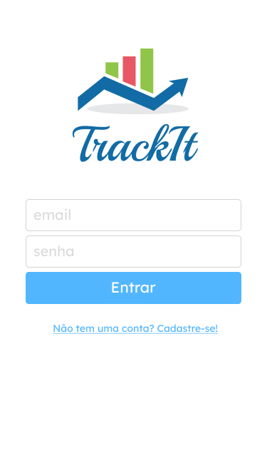
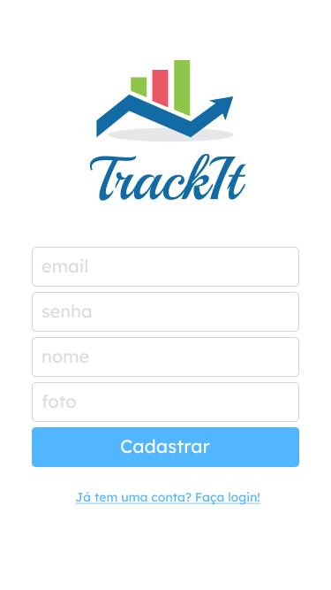
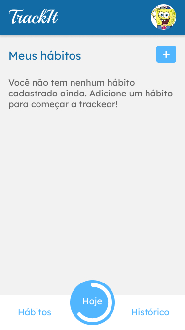
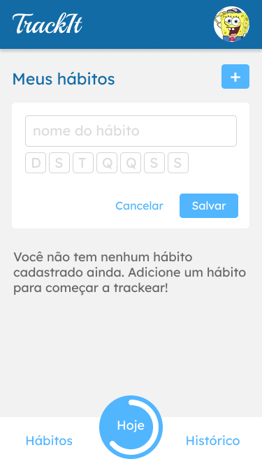
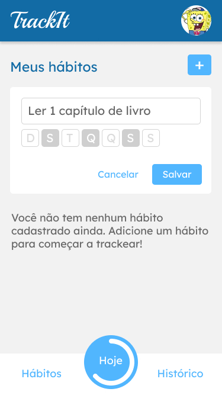
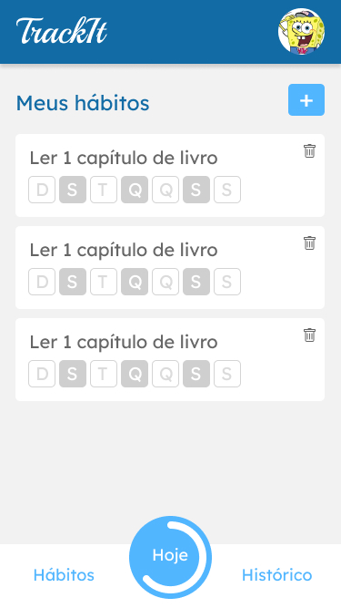
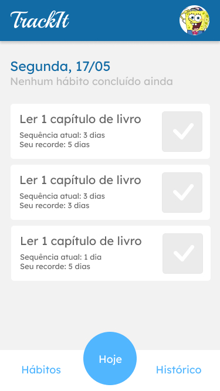
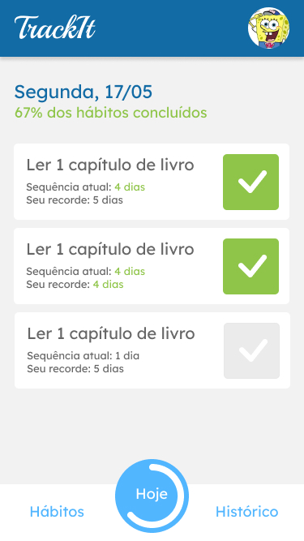

# Trackit 
<table>
  <tr>
    <td align="center" style="padding: 0; margin: 0;">
      
    </td>
    <td align="center" style="padding: 0; margin: 0;">
      
    </td>
    <td align="center" style="padding: 0; margin: 0;">
      
    </td>
    <td align="center" style="padding: 0; margin: 0;">
      
    </td>
  </tr>
</table>

<table>
  <tr>
    <td align="center" style="padding: 0; margin: 0;">
      
    </td>
    <td align="center" style="padding: 0; margin: 0;">
      
    </td>
    <td align="center" style="padding: 0; margin: 0;">
      
    </td>
    <td align="center" style="padding: 0; margin: 0;">
      
    </td>
  </tr>
</table>

## Sobre

Trackit uma aplicação c de acompanhamento de hábitos. Nele é possível registrar um hábito, acompanhar o andamento de seus hábitos.


Este é um projeto está construido em [React.js](https://pt-br.legacy.reactjs.org/docs/getting-started.html). 


## Instalação
### 1 - Instalar as dependencias

```
  npm install
```

### 2 - Execute o projeto

```bash
  npm start
```
